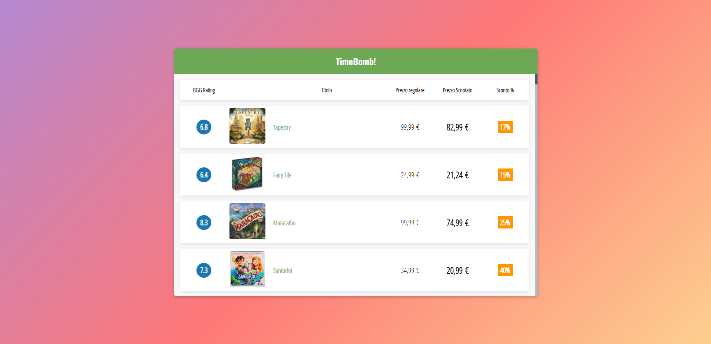

# TimeBomb!



Semplice applicazione web che esegue lo scraping dei prodotti in offerta temporanea del sito [DungeonDice](https://www.dungeondice.it/366-offerte-a-tempo), li elenca in un una tabella, e ne individua per ciascuno il relativo rating (valutazione generata dalla community di appassionati) sul noto portale [BoardGameGeek](https://boardgamegeek.com/).

La parte frontend è stata sviluppata con ReactJS. Consiste in una applicazione a singola pagina, in cui viene costruita la tabella dei prodotti ricevuti dal backend in risposta a chiamate API asincrone.

Il backend è sviluppato con flask - nella sua versione restful - ed espone le API necessarie al funzionamento ai seguenti endpoint:

-   [GET] /api/timebomb/:page - per mezzo del modulo _beautifulsoup_ viene eseguito lo scraping della pagina delle offerte, restituendo un oggetto popolato dai campi opportuni di ciascun prodotto (titolo, link, immagine, prezzo scontato, prezzo regolare). Il numero della pagina richiesto è quello indicato dalla variabile _page_ passata come argomento.
-   [GET] /api/game/:title - il titolo di ciascun prodotto viene quindi usato come argomento dal modulo [BGG-Client](https://github.com/marcioos/bgg-client), andando a catturare le relative informazioni memorizzate nel portale, in particolare il rating generato dalla community.

Al termine delle chiamate, ogni riga viene popolata e aggiornata con le informazioni provenienti da entrambi gli endpoint.

## Installazione

Dalla cartella principale usare npm per installare le dipendenze del progetto.

```bash
npm install
```

## Uso

Frontend

```javascript
npm start
```

Backend (API)

```javascript
cd api && flask run
```

## Considerazioni

L'applicazione è da considerarsi un puro esercizio di sviluppo e sperimentazione personale, priva di qualsiasi affiliazione ai siti citati. Nasce dalla passione sul mondo dei boardgames e vuole essere un semplice tentativo per unire la curiosità sull'andamento del mercato e le valutazioni della comunità di giocatori in relazione ai prodotti messi in offerta, sfruttando alcune tecniche dello sviluppo web moderno.

## Licenza

[MIT](https://choosealicense.com/licenses/mit/)
